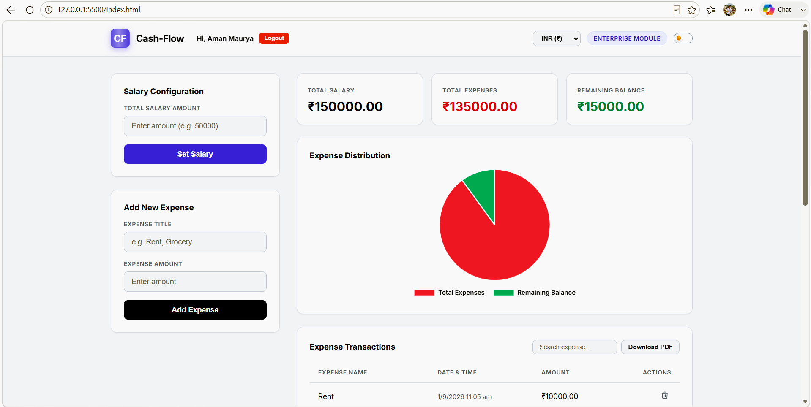
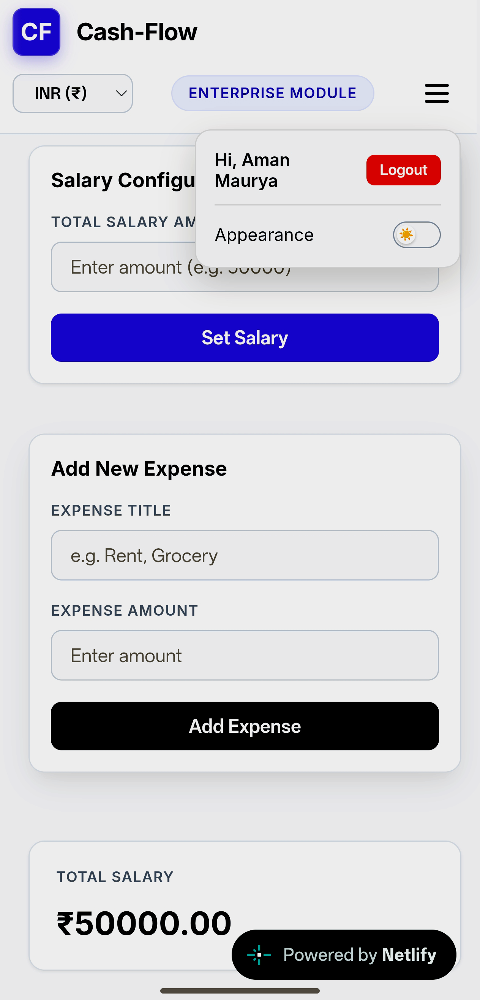
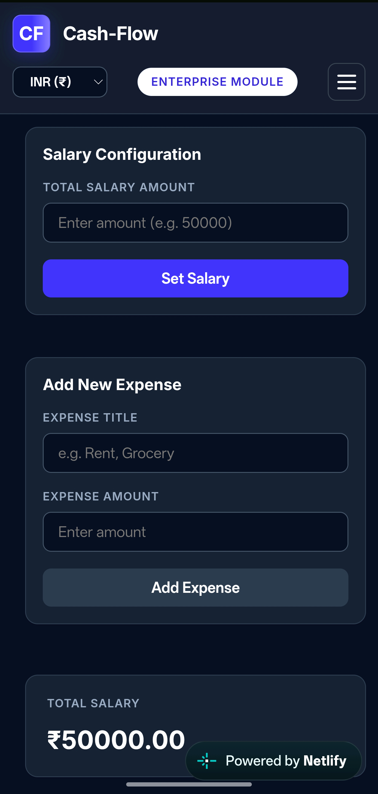
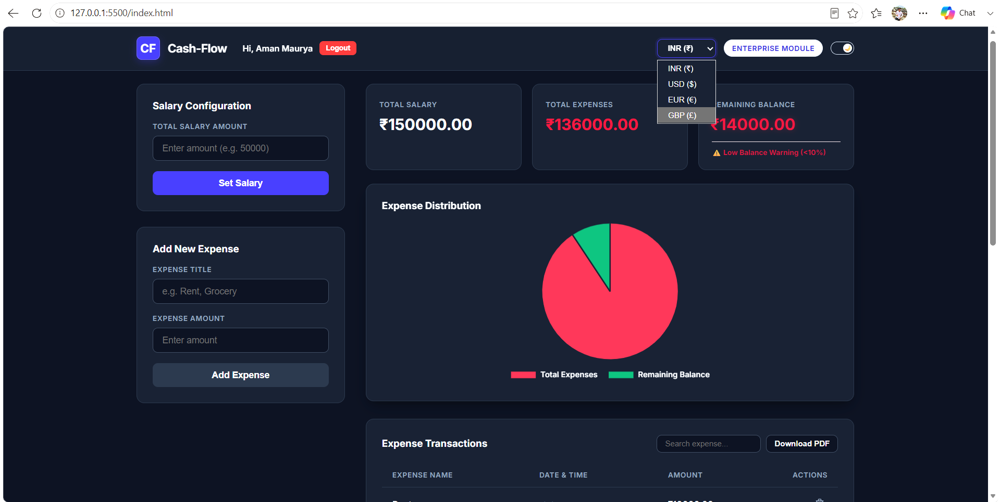
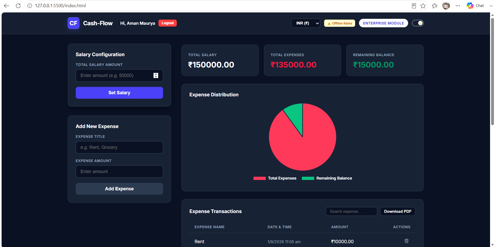

# Prodesk IT - Cash-Flow — Enterprise Salary & Expense Tracker Module

A responsive enterprise-grade financial dashboard developed in Vanilla JavaScript, featuring real-time calculations, secure session handling, data persistence, dynamic data visualization, and PDF report generation.

## Live Website

https://cash-flow-tracker-aman.netlify.app

## Features

### Secure Mock Login: 

Enterprise-style authentication prototype backed by sessionStorage with keyboard accessibility (Enter-key submission).

### Salary & Expense Management:

 Full CRUD operations to input total salary, log expenses, and instantly update calculations.

### Real-Time Calculations: 

Automatic tracking of Total Salary, Total Expenses, and Remaining Balance.

### Threshold Alerts: 

Critical UI warning banners and red text alerts when the remaining balance drops below 10% of the total salary.

### Data Persistence: 

Seamless state management using browser localStorage to retain data across page reloads.

### Data Visualization: 

Interactive dynamic Pie Chart rendered via Chart.js representing expenses versus remaining balance.

### Multi-Currency Conversion: 

Live currency toggle support (INR, USD, EUR, GBP) updating financial metrics instantly.

### PDF Report Generation:

Export formatted financial summary reports including user credentials and timestamps using jsPDF.

### Responsive UI & Navigation:

Clean adaptive layout equipped with a mobile hamburger menu and theme-aware Dark/Light mode toggle.

## Tech Stack

HTML5
Vanilla CSS3 (Custom Properties & Responsive Design)
JavaScript (ES6+, DOM Manipulation, Event Architecture)
Chart.js (CDN Integration)
jsPDF (CDN Integration)
LocalStorage & SessionStorage APIs

## Project Structure:

cash-flow-tracker/
├── public/
│   └── screenshots/
│       ├── desktop.png
│       ├── mobile.png
│       └── dark-mode.png
├── index.html
├── style.css
├── script.js
├── Prompts.md
└── README.md

## Project Screenshots

### Desktop View

### Mobile View

### Core Feature (Dark Mode)

